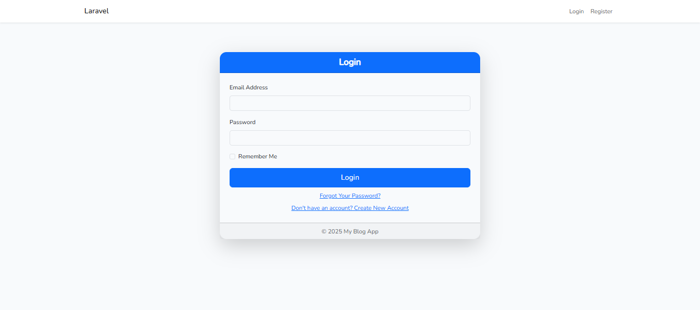
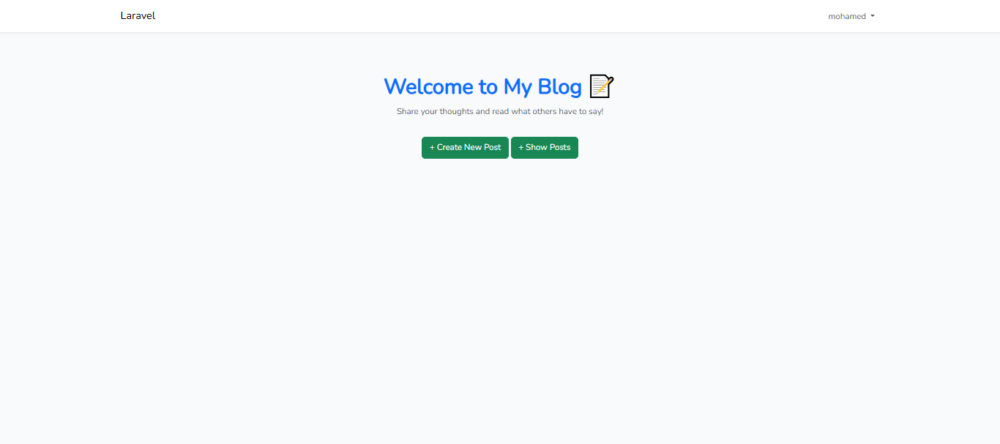
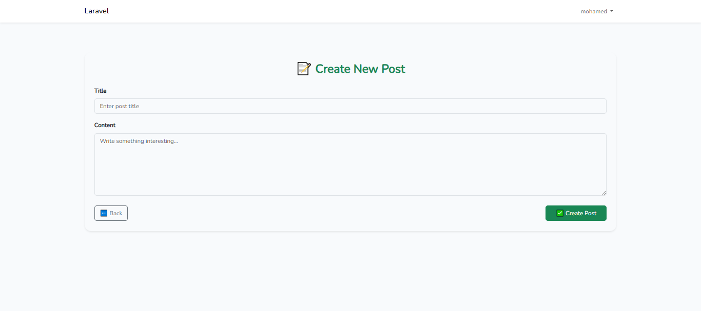
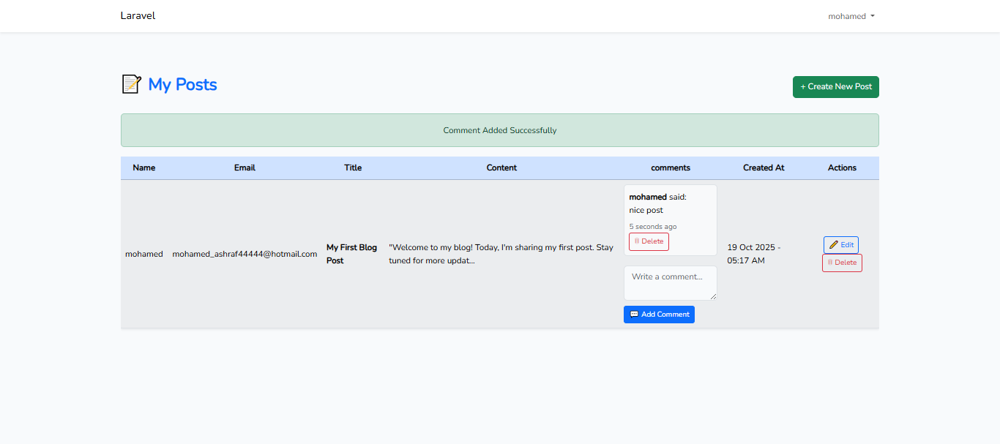

HEAD

# 📝 Laravel Blog Platform

A simple **Blog Platform** built with **Laravel 12** that allows users to register, create posts, comment, and manage their content.

---

## 🚀 Features

- **User Authentication**
  - Register, login, logout
  - Email verification for sensitive actions
- **Posts**
  - Create, Read, Update, Delete (CRUD)
  - Only the author can edit or delete their posts
- **Comments**
  - Add comments to posts
  - Delete own comments
  - Validation for comment content

---

## 📦 Database Structure

- **Users**
  - `id`, `name`, `email`, `password`, `email_verified_at`, `timestamps`
- **Posts**
  - `id`, `title`, `content`, `user_id`, `timestamps`
- **Comments**
  - `id`, `content`, `user_id`, `post_id`, `timestamps`

### Relationships

- A **User** has many **Posts** and **Comments**
- A **Post** has many **Comments**

---

## 🛠 Installation

1. Clone the repository:

`bash
git clone https://github.com/YOUR_USERNAME/YOUR_REPOSITORY.git
cd YOUR_REPOSITORY

2. Install dependencies:
    composer install
    npm install
    npm run dev

3. Copy .env.example to .env and configure your database:
    cp .env.example .env
    php artisan key:generate

4. Run migrations:
    php artisan migrate

5.Serve the application:
    php artisan serve

6. Access the app
    Open your browser and go to: 👉 http://127.0.0.1:8000

## 🧩 Routes Overview
           
    | Route           | Method | Description                     |
    |-----------------|--------|---------------------------------|
    | /               | GET    | Home page / list of posts       |
    | /create         | GET    | Create new post                 |
    | /store          | POST   | Store post                      |
    | /show           | GET    | Show all posts for current user |
    | /edit/{id}      | GET    | Edit post                        |
    | /update/{id}    | PUT    | Update post                     |
    | /destroy/{id}   | DELETE | Delete post                     |
    | /store/{id}     | POST   | Add comment to post             |
    | /destroy/{id}   | DELETE | Delete comment                  |

    
## 📸 Screenshots
   **Login Page**  
        
        
   **Main Page**  
        
        
   **Create Post**  
        

   **Posts And Posts Action**
        

   
## 🛡 Authentication & Verification
    - Only authenticated users can create, update, or delete posts/comments.
    - Email verification required for certain actions (like adding comments).

## 🧪 Testing
    - Ensure CRUD operations and comment functionality work for authenticated users.

## ⚡ Tech Stack
    - PHP 8.x
    - Laravel 12.x
    - MySQL / PostgreSQL
    - Bootstrap 5 (Frontend styling)
    - GitHub for version control

## ⚠️ Notes
   - Make sure your PHP version is 8.3.16+ for Laravel 12
   - Ensure Node.js & npm are installed for building assets
   - Images in screenshots/ folder must match the filenames in the Markdown

## 🧑‍💻 Author
 **Mohamed Ashraf**  
  📧 Email: mohamed_ashraf4444@hotmail.com  
  🌐 GitHub: [https://github.com/salah3122001](https://github.com/salah3122001)  
  🔗 LinkedIn: [https://www.linkedin.com/in/mohamed-ashraf-14916a367](https://www.linkedin.com/in/mohamed-ashraf-14916a367)
       

---
    
 22f9d48 (README.md)
